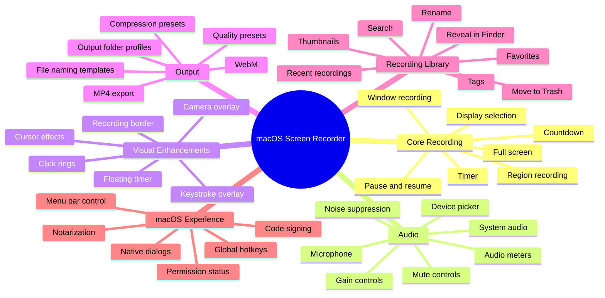
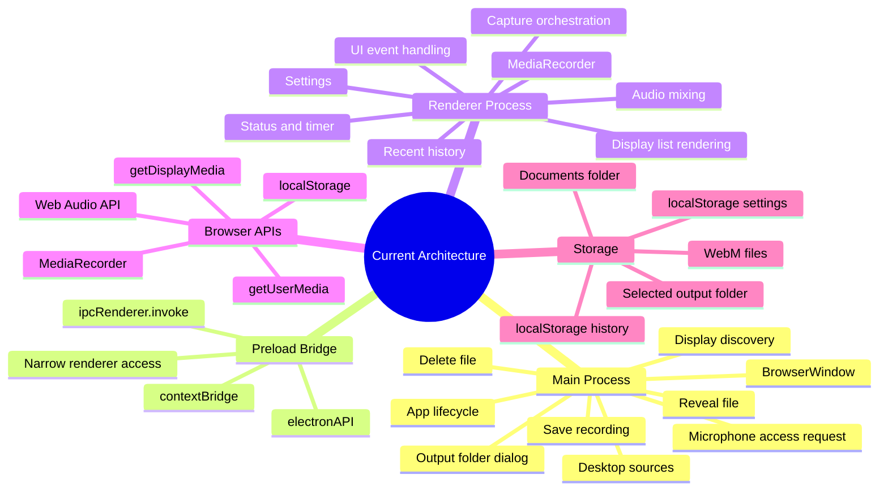
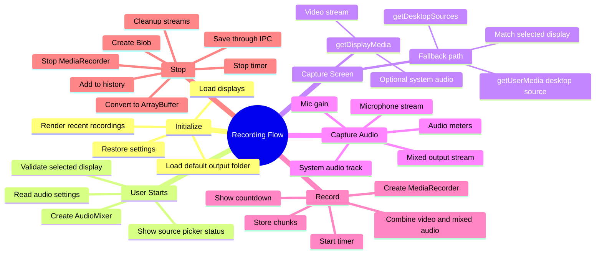
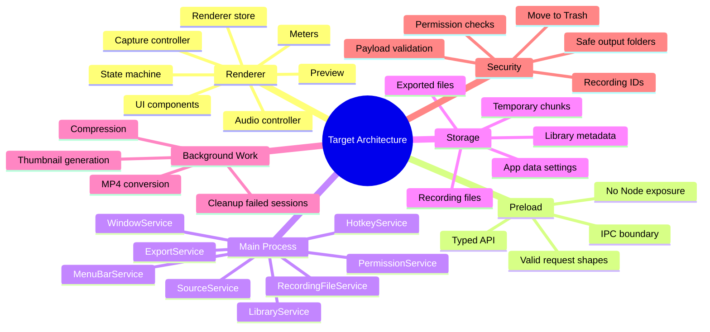
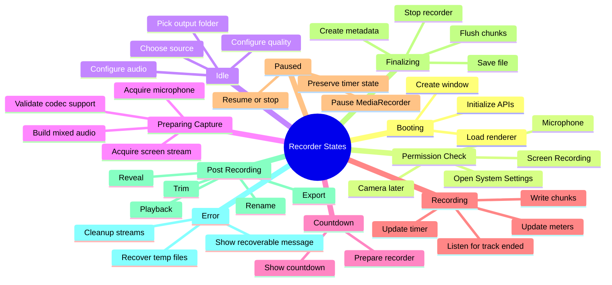
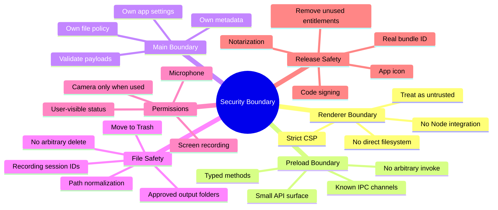
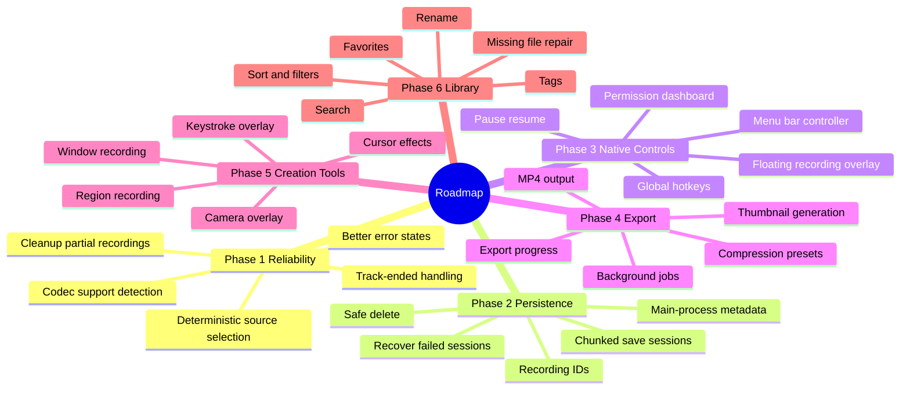

# macOS Screen Recorder: Mind Maps

## Product Mind Map

## Current Architecture Mind Map

## Recording Flow Mind Map

## Target Architecture Mind Map

## State Machine Mind Map

## Security Mind Map

## Implementation Roadmap Mind Map

