# macOS Screen Recorder: System Design and Flow Architecture

## Purpose

This document describes the current architecture of the Electron-based macOS Screen Recorder and proposes a stronger target architecture for future features such as pause/resume, MP4 export, webcam overlay, global hotkeys, menu bar mode, and a richer recordings library.

## Current System Overview

The app is a single-window Electron desktop application. The main process owns native Electron capabilities such as windows, display discovery, desktop sources, filesystem writes, dialogs, and Finder actions. The renderer owns the UI, browser media capture, microphone capture, audio mixing, recording state, settings, and recent recording history.

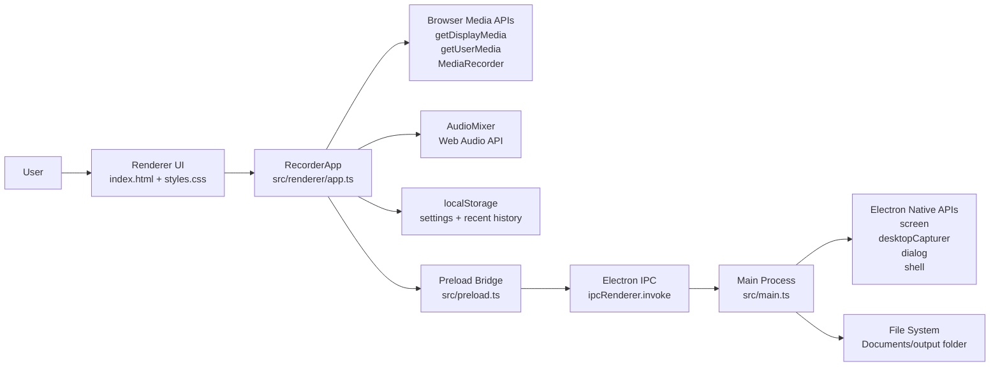

## Current Runtime Components

| Component | File | Responsibility |
| --- | --- | --- |
| Main process | `src/main.ts` | Creates the app window, asks for microphone access, exposes IPC handlers, reads display/source data, saves/deletes files. |
| Preload bridge | `src/preload.ts` | Exposes a controlled `window.electronAPI` to the renderer. |
| Renderer app | `src/renderer/app.ts` | Handles UI events, capture flow, recording, audio mixing, settings, recent history, and status updates. |
| Renderer view | `src/renderer/index.html` | Defines the visible controls and sections. |
| Renderer styles | `src/renderer/styles.css` | Styles the app UI. |
| Build config | `package.json`, `tsconfig.json` | Builds TypeScript, copies renderer assets, and packages with Electron Builder. |

## Current IPC Surface

```mermaid
flowchart TB
  Renderer["Renderer"] -->|getDisplays()| MainGetDisplays["get-displays"]
  Renderer -->|getDesktopSources()| MainSources["get-desktop-sources"]
  Renderer -->|openScreenPrivacySettings()| MainPrivacy["open-screen-privacy-settings"]
  Renderer -->|saveRecording(buffer, filename, folder)| MainSave["save-recording"]
  Renderer -->|pickOutputFolder()| MainPick["pick-output-folder"]
  Renderer -->|getDefaultOutput()| MainDefault["get-default-output"]
  Renderer -->|revealFile(path)| MainReveal["reveal-file"]
  Renderer -->|deleteFile(path)| MainDelete["delete-file"]

  MainGetDisplays --> Screen["electron.screen"]
  MainSources --> DesktopCapturer["electron.desktopCapturer"]
  MainPrivacy --> SystemSettings["macOS System Settings"]
  MainSave --> FSWrite["fs.writeFileSync"]
  MainPick --> Dialog["dialog.showOpenDialog"]
  MainDefault --> AppPaths["app.getPath('documents')"]
  MainReveal --> Finder["shell.showItemInFolder"]
  MainDelete --> FSDelete["fs.unlinkSync"]
```

## Current Recording Flow

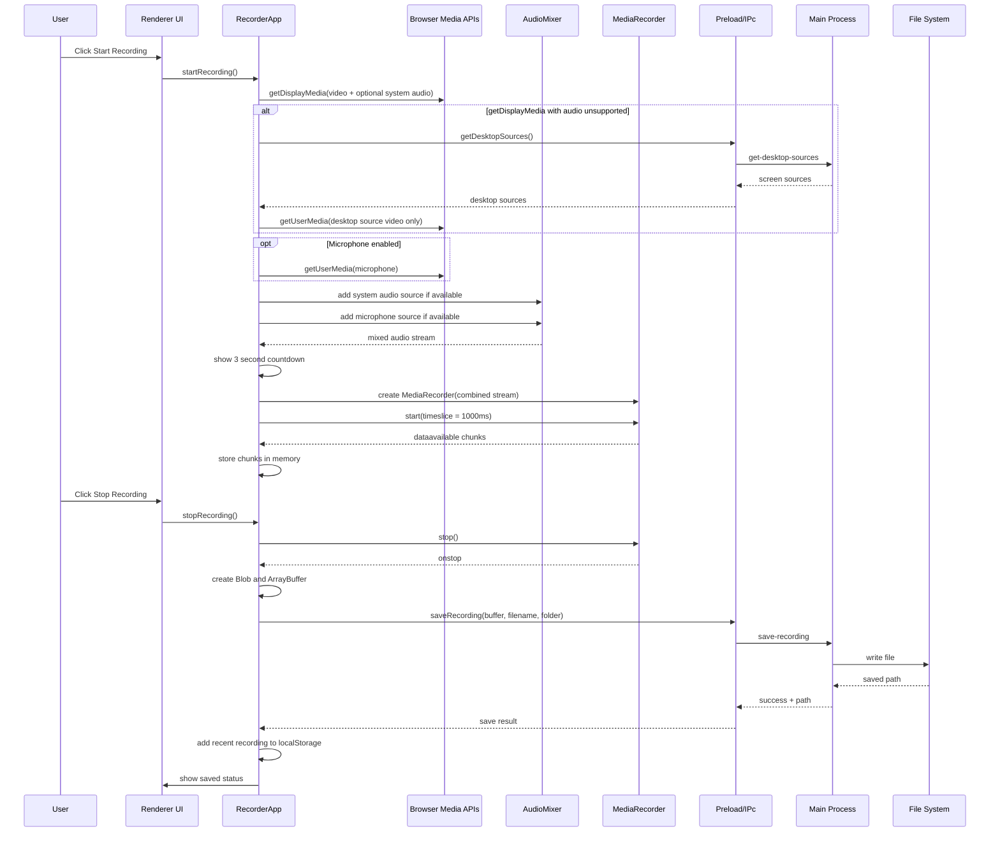

## Current State Model

The current implementation uses a small set of booleans and nullable fields instead of an explicit state machine.

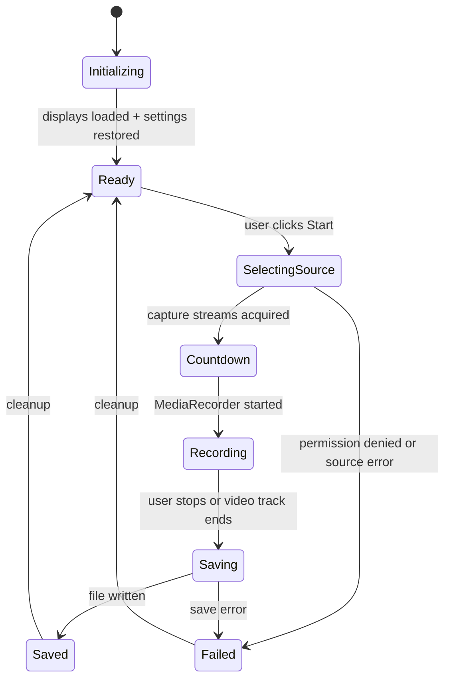

Recommended future state machine:

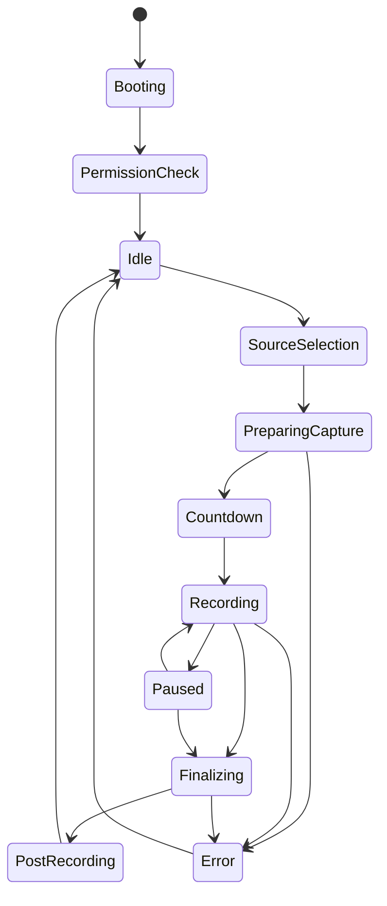

## Current Data Flow

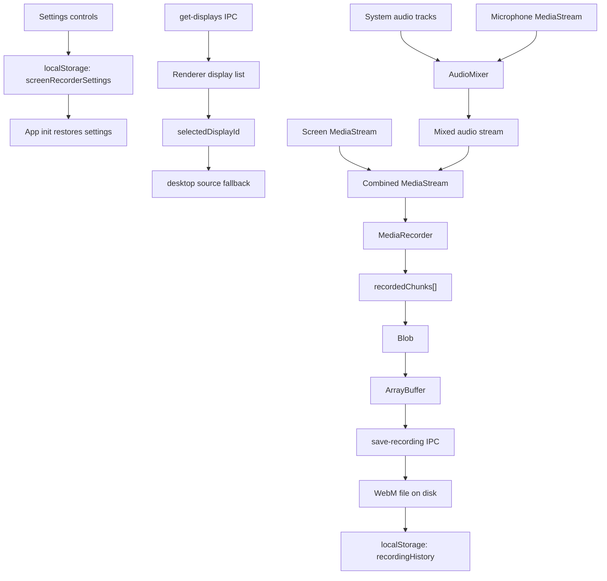

## Recommended Target Architecture

The app will scale better if capture logic, persistence, and native operations move behind explicit services. The renderer should become mostly UI orchestration and live media preview, while the main process owns trusted persistence, file operations, hotkeys, menu bar control, and export jobs.

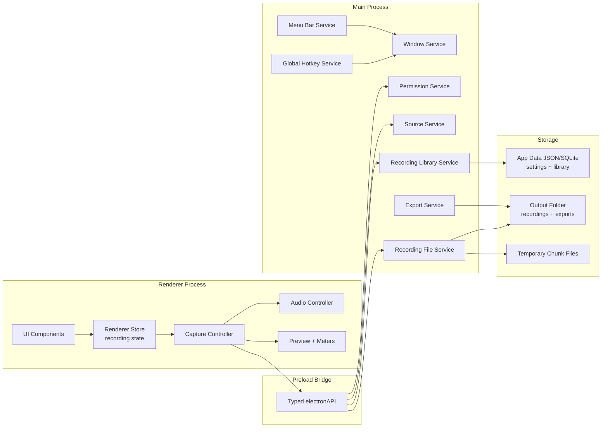

## Future Module Breakdown

| Module | Process | Responsibility |
| --- | --- | --- |
| `PermissionService` | Main | Check/open macOS Screen Recording, Microphone, and Camera permissions. |
| `SourceService` | Main | Return displays, windows, thumbnails, and source metadata. |
| `CaptureController` | Renderer | Acquire screen/window/region streams and coordinate recording lifecycle. |
| `AudioController` | Renderer | Manage microphone selection, system audio, gain, mute, meters, and mixing. |
| `RecorderStateMachine` | Renderer | Enforce valid transitions across idle, recording, paused, saving, and error states. |
| `RecordingFileService` | Main | Create recording sessions, append chunks, finalize files, clean temporary files. |
| `LibraryService` | Main | Store recording metadata, search, rename, delete/move-to-trash, and repair missing records. |
| `ExportService` | Main or worker | Convert WebM to MP4, compress, generate thumbnails, and run background export jobs. |
| `HotkeyService` | Main | Register global start/stop/pause shortcuts. |
| `MenuBarService` | Main | Provide menu bar status, timer, and quick actions. |

## Recommended Future Save Flow

The current app saves only after recording stops. A safer design is session-based chunk persistence.

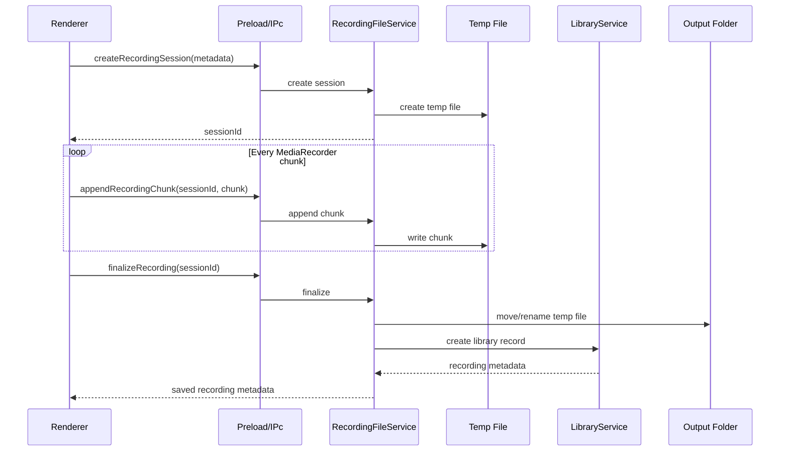

Benefits:

- Long recordings do not live entirely in renderer memory.
- A crashed renderer can leave recoverable temporary chunks.
- Main process can validate paths and enforce safe output directories.
- Library metadata can be created in one trusted place.

## Recommended Permission Flow

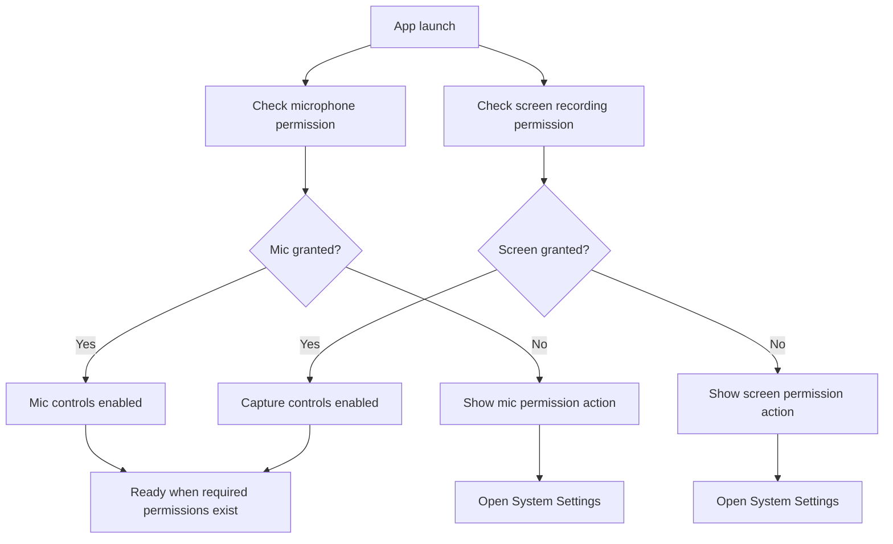

## Recommended Feature Flow: Pause and Resume

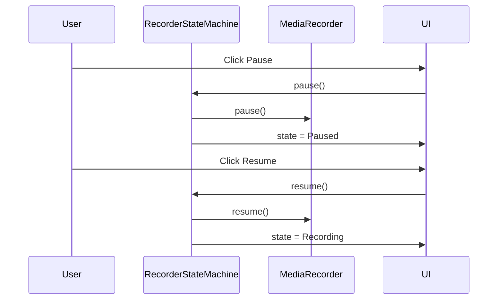

## Recommended Feature Flow: MP4 Export

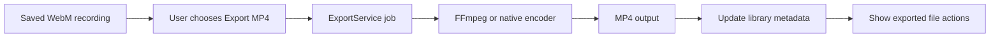

## Security Boundaries

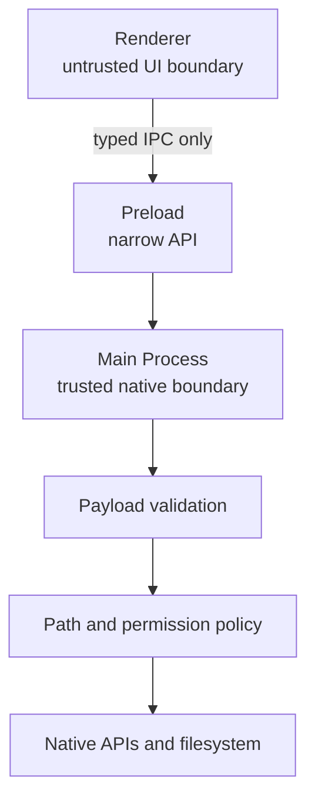

Recommended rules:

- Renderer never sends arbitrary file paths for deletion without a known recording ID.
- Main process validates every IPC payload.
- Main process owns output folder permissions and recording metadata.
- Delete should move files to Trash when possible.
- Export jobs should write only to approved folders.

## Deployment Architecture

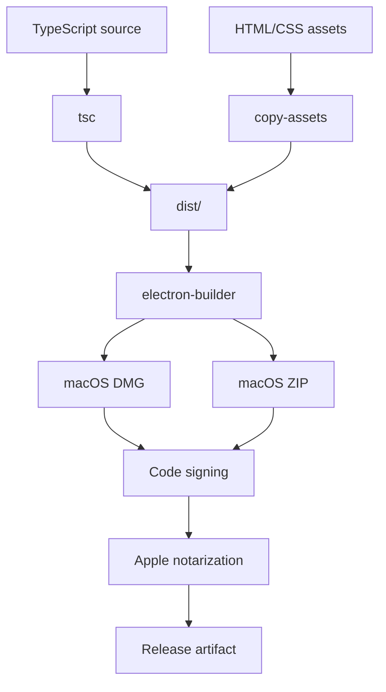

## Implementation Roadmap

1. Create explicit recorder states and replace scattered boolean state with a state machine.
2. Replace full-buffer saving with chunked recording sessions.
3. Move recording history from `localStorage` to main-process app data storage.
4. Harden IPC request validation and file path policies.
5. Add source thumbnails and make source selection deterministic.
6. Add pause/resume.
7. Add global hotkeys and menu bar controls.
8. Add MP4 export and thumbnail generation.
9. Add webcam overlay and cursor effects.
10. Add a searchable recording library.

## Summary

The current architecture is appropriate for a prototype or minimal local recorder. For a polished macOS app, the main process should own trusted system operations, persistent metadata, file safety, hotkeys, menu bar controls, and export jobs. The renderer should focus on UI, media stream acquisition, live controls, previews, and a clear recording state machine.

